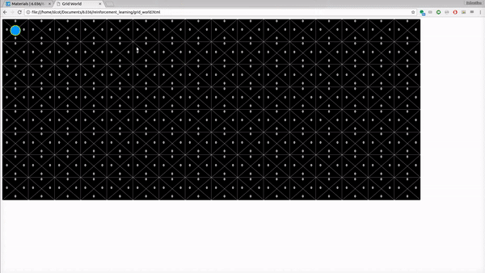

# Q-Learning Demo

This is a demo of how Q-Learning can be used to find an optimal policy for an agent in a grid to stay along
the main diagonal of a square matrix in the right-ish side of the grid. Training is initiated with an arrow key.
When training is done, the ```d``` key concludes training and follows the optimal policy and the ```r``` key
resets the state to the start state.




